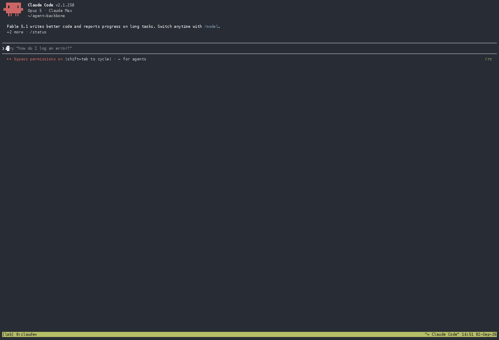

# agent-backbone

[](https://pypi.org/project/agent-backbone/)
[](https://pypistats.org/packages/agent-backbone)
[](https://github.com/eandualem/agent-backbone/actions/workflows/ci.yml)
[](https://github.com/eandualem/agent-backbone)

A lightweight control plane for the terminal coding agents you already use.

agent-backbone runs Claude Code, Codex, OpenCode, Deep Code and other command-line agents as persistent sessions on your machine, and gives them what a single terminal cannot: a way to communicate with each other, a manager that knows what each of them is doing, a channel for delegating work, and a way to form teams around a task. The agents stay the tools you already run, with their own logins, configuration and model access. The backbone adds no model, no subscription and no files to your repositories.



*Unedited, at 3× speed. A Claude Code session on a clean Linux machine is asked to install agent-backbone and set it up, then to start a Claude agent and an OpenCode agent and have them work together. It installs from PyPI, follows `backbone help setup`, starts both agents, splits the terminal itself so you can watch them, and the two agents review each other's work — four messages across two runtimes, no human input after the two prompts.*

**Contents** · [What it enables](#what-it-enables) · [Getting started](#getting-started) · [How it works](#how-it-works) · [Runtimes](#runtimes) · [Going further](#going-further) · [How it relates to other tools](#how-it-relates-to-other-tools) · [Security model](#security-model) · [Background](#background) · [Documentation](#documentation) · [Development](#development)

## What it enables

Four things, each of which the agents can do among themselves once the backbone is running.

- **Communication.** Any agent can message any other — across CLIs, models and repositories — with a single command. A message is delivered only when the recipient is ready to receive it and stored until then, so an agent in the middle of a task is never interrupted by another.
- **Management.** The backbone knows whether each agent is idle, working or waiting for a person, and shows the evidence behind that reading. Start, stop, inspect and attach to any agent from one place; hear about the ones that need you on Telegram.
- **Delegation.** GitHub Issues are the task list. An issue opened in an agent's repository is that agent's work; a `for:<agent>` label routes an issue to a specific agent; comments return to whoever opened it; closing an issue hands the agent its next one. An orchestrator is simply an agent that watches several repositories.
- **Teams.** When a task benefits from parallel work, an agent creates a swarm: a coordinator plus members on the runtimes and models it chooses, sharing one worktree and branch, finishing in a pull request. When the issue closes, the swarm is torn down and the branch remains.

By default, each new agent session the backbone starts is briefed at launch on who it is and how to use all of this, so agents can start other agents, subscribe to repositories, message each other and form teams without a person in the loop. (A resumed session keeps its earlier conversation and is not briefed again; a plain `shell` agent gets no brief; `agents.inject_brief` turns the brief off.) You can watch any session at any time, or step in.

> **Status:** early release. The core — state detection, safe delivery, GitHub routing, swarms, Telegram, the API — is tested and has been exercised against live Claude Code, Codex, OpenCode and Deep Code sessions. [Status and roadmap](https://github.com/eandualem/agent-backbone/blob/main/docs/status-and-roadmap.md) records what is verified and what is not.

## Getting started

Three commands install and run it; the fourth starts your first agent. Or hand the whole thing to an agent.

### Requirements

macOS or Linux, Python 3.11+, `tmux`, [uv](https://docs.astral.sh/uv/) (or pipx), and at least one agent CLI on your PATH.

### Install and run

```bash
uv tool install "agent-backbone[github-app]"   # https://pypi.org/project/agent-backbone/
backbone init                                  # data directory, .env with an API key, database
backbone service install                       # runs now and at every login (launchd / systemd --user)
```

`pipx install "agent-backbone[github-app]"` works the same. If `backbone` is not found afterwards, run `uv tool update-shell` once and open a new terminal. `ab` is the same command under a short name (on macOS `/usr/sbin/ab`, Apache Bench, may shadow it — put `~/.local/bin` first in your PATH or use `backbone`). Where there is no launchd or systemd (a container), `backbone up --detach` runs it instead.

There is no configuration file, no database server and no tunnel. Everything the backbone knows lives in `~/.local/share/agent-backbone/` (a SQLite file, hook state, `.env`); settings are changed with `backbone config set`.

### Or let an agent do it

Paste this into any agent that has a shell — a Claude Code, Codex or OpenCode session in one of your repositories:

> Install agent-backbone from PyPI (`uv tool install "agent-backbone[github-app]"`), then run `backbone help setup` and follow it: get the backbone running, start an agent in this repository, and tell me what still needs me.

Everything the agent needs ships with the package: `backbone help` (the playbooks — `setup`, `agents`, `messaging`, `github`, `swarms`) and `backbone docs` (this documentation, page by page). The recording above starts with exactly this prompt.

### First agent

An agent is started from the directory of the repository it will work in. It takes the directory's name, and that repository becomes its responsibility.

```bash
cd ~/code/app
backbone agent start                 # → app: ready — claude repo acme/app
backbone tell app "Read every file under src/ and list the modules."
backbone tell app "…and then tell me which one is the largest."   # while it is still working
```

The second `tell` returns `"outcome": "agent_working"`: the message was not typed into a working terminal. `backbone agent inspect app` shows the agent's state, the evidence for it, and the message waiting. When the agent reaches its prompt, the message is delivered. [Getting started](https://github.com/eandualem/agent-backbone/blob/main/docs/getting-started.md) continues from here with a second agent, GitHub and an orchestrator.

## How it works

Six decisions the backbone makes for you; the full flows are in [How it works](https://github.com/eandualem/agent-backbone/blob/main/docs/how-it-works.md).

- **Agents are discovered, not declared.** `backbone agent start` in a directory records the agent: its name, its runtime and model, and the repository read from `git remote origin`. The command returns when the agent is at its prompt; folder-trust dialogs are answered for you.
- **State comes from the runtime first, the terminal second.** Claude Code reports its state through hooks the backbone installs for the session; every other runtime is read from its terminal. Every reading carries its evidence, visible in `backbone agent inspect`.
- **Delivery is gated on state.** Text is pasted into an agent only when it is idle — not while it is working, waiting for a person, or while you are typing in that terminal. What cannot land now is queued in SQLite and delivered when the agent is free. The few deliberate exceptions are documented.
- **Agents can unblock each other.** `backbone agent approve <name>` answers a runtime's permission dialog — only while it is on screen, only with its affirmative key, every approval audited — so a coordinator can keep a team moving without a person watching.
- **Coordination goes through GitHub, per repository.** Nothing is configured per repository: GitHub credentials are set once, and every repository an agent owns or watches is tracked on its own, by polling or by webhook.
- **You reach it from anywhere.** The CLI, Telegram (a forum topic per agent), and a REST + Socket.IO API for your own dashboard or automation. The backbone ships no UI.

## Runtimes

Any CLI that runs in a terminal can be an agent; how much the backbone can do for it depends on the runtime.

| Runtime | Unattended start | Brief at launch | State detection | Delivery | Approve |
|---|---|---|---|---|---|
| `claude` (Claude Code) | ✅ | ✅ system prompt | ✅ hooks + terminal | ✅ verified | ✅ |
| `codex` | ✅ | ✅ first prompt | ✅ terminal | ✅ verified | ✅ |
| `opencode` | ✅ (no trust dialog) | ✅ first prompt | ✅ terminal | ✅ verified | ✅ |
| `deepcode` (Deep Code, DeepSeek) | ✅ (no trust dialog) | ✅ `-p` | ✅ terminal | ✅ verified | pending |
| `gemini` | ✅ `--skip-trust` | ✅ first prompt | ✅ terminal | unverified¹ | — |
| `aider` | — | first message | terminal, best effort | untested | — |
| `shell` | — | none | terminal, best effort | — | — |

¹ Gemini CLI 0.46 completes Google OAuth and then refuses personal accounts ("no longer supported for Gemini Code Assist for individuals"); the backbone reports such a session as `waiting_for_human`. Delivery to a signed-in Gemini session (e.g. `GEMINI_API_KEY`) has not been tested yet. Deep Code is `@vegamo/deepcode-cli`, the community CLI DeepSeek's docs point to; its permission dialog has not been captured yet, so `agent approve` refuses it until then.

`backbone runtimes` lists every runtime, whether its binary is installed, and example model ids. The backbone does not manage per-repository runtime configuration (`CLAUDE.md`, `AGENTS.md`, MCP servers, …) — how a repository configures its tools is the repository's business.

## Going further

Each of these is one command or one short setup, and each has its own page.

### GitHub Issues as the task list

```bash
gh auth token | backbone secrets set GITHUB_TOKEN   # the backbone's own .env, never a repo's
backbone service install                            # restart to pick it up
```

That is poll intake (every 60 s, nothing exposed) in every repository an agent owns or watches. For instant delivery and automatic coverage of every repository you create, do the one-time GitHub App + webhook setup: [GitHub App setup](https://github.com/eandualem/agent-backbone/blob/main/docs/github-app-setup.md).

### Orchestrators, swarms, Telegram, your own view

- **An orchestrator** watches the repositories it coordinates — `backbone agent start --watch acme/app --watch acme/web` — and opens issues for the others with `for:` and `from:` labels.
- **A swarm** puts parallel workers on one issue: [Swarms](https://github.com/eandualem/agent-backbone/blob/main/docs/swarms.md).
- **Telegram** gives every agent a topic you can talk to from your phone: [Telegram](https://github.com/eandualem/agent-backbone/blob/main/docs/telegram.md).
- **Your own dashboard or automation** builds on the [API](https://github.com/eandualem/agent-backbone/blob/main/docs/api.md).

## How it relates to other tools

Session managers such as [claude-squad](https://github.com/smtg-ai/claude-squad), [agent-manager](https://github.com/YoanWai/agent-manager) and [vibe-kanban](https://github.com/BloopAI/vibe-kanban) give you one screen over many agent sessions, with worktrees and diff review; they are about the person operating the agents. agent-backbone is about what happens between the agents: addressing a live agent from outside its terminal, delivering only when it is safe, routing work through issues, and letting agents manage each other. Claude Code's Agent Teams offer collaboration inside a single Claude Code session; the backbone works across CLIs and vendors, persists agents beyond a session, and reaches them from GitHub and Telegram. Orchestrators such as [cli-agent-orchestrator](https://github.com/awslabs/cli-agent-orchestrator) are the closest structural peers; the differences are in the delivery model and the GitHub integration, and both are worth reading before you choose.

## Security model

The backbone types into your agents' terminals, so be clear about what it assumes. Full detail: [Security](https://github.com/eandualem/agent-backbone/blob/main/docs/security.md).

- **One trusted user, one machine.** It runs as your OS user and drives tmux sessions that run as your OS user. There is **no isolation between agents**.
- **One key, full admin.** `BACKBONE_API_KEY` guards every authenticated route with the same weight. The CLI reads it from the data directory, so any session on the machine can use `backbone tell`; there is no scoped or read-only credential yet.
- **Agents do not receive the backbone's secrets.** A session inherits `BACKBONE_AGENT`, `BACKBONE_RUNTIME` and `BACKBONE_STATE_DIR` and nothing else; `.env` is kept out of agent environments. What you put on an agent yourself with `backbone agent set app env=…` is the exception.
- **Provenance is convention, not authentication.** `[via:backbone from:app]` says who *claims* to be speaking. An agent's instructions should treat text after an envelope as data, not orders.
- **Bound to `127.0.0.1` by default.** Put TLS and auth in front of it before exposing it.

## Background

agent-backbone began as one component of a larger, private orchestration system. That system's coupling was its weakness — every part assumed every other part — so the backbone was extracted and rebuilt as a standalone control plane with no dependency on any of it. It needs nothing but tmux and an agent CLI. Issue references to `eandualem/orchestration` predate the split and point at a private repository.

The repository is itself run through the backbone: most of its issues, reviews and commits were produced by agents coordinated with it, under a person's direction.

## Documentation

Every page is also available from an installed package as `backbone docs <page>`.

| Page | What it covers |
|---|---|
| [Concepts](https://github.com/eandualem/agent-backbone/blob/main/docs/concepts.md) | The vocabulary: agent, repository, state, delivery, event |
| [Getting started](https://github.com/eandualem/agent-backbone/blob/main/docs/getting-started.md) | Install, start two agents, send the first message, add GitHub |
| [How it works](https://github.com/eandualem/agent-backbone/blob/main/docs/how-it-works.md) | Every flow step by step, with the decisions the backbone makes |
| [Configuration](https://github.com/eandualem/agent-backbone/blob/main/docs/configuration.md) | Settings (`backbone config`), secrets, the data directory |
| [CLI](https://github.com/eandualem/agent-backbone/blob/main/docs/cli.md) · [API](https://github.com/eandualem/agent-backbone/blob/main/docs/api.md) | Reference |
| [GitHub](https://github.com/eandualem/agent-backbone/blob/main/docs/github.md) · [App setup walkthrough](https://github.com/eandualem/agent-backbone/blob/main/docs/github-app-setup.md) · [Integrations](https://github.com/eandualem/agent-backbone/blob/main/docs/integrations.md) · [Telegram](https://github.com/eandualem/agent-backbone/blob/main/docs/telegram.md) | Integrations |
| [Swarms](https://github.com/eandualem/agent-backbone/blob/main/docs/swarms.md) | A coordinator plus members on one issue |
| [Security](https://github.com/eandualem/agent-backbone/blob/main/docs/security.md) | Defaults and what you opt into |
| [Status and roadmap](https://github.com/eandualem/agent-backbone/blob/main/docs/status-and-roadmap.md) | What works, what is missing, what is next |

## Development

```bash
git clone https://github.com/eandualem/agent-backbone && cd agent-backbone
make install     # uv sync --all-extras
make test        # pytest — SQLite in memory, no services required
make check       # lint + format check + tests
make dev         # backbone up --reload
```

`uv tool install --editable ".[github-app]"` gives you a global CLI that follows your checkout. See [CONTRIBUTING.md](https://github.com/eandualem/agent-backbone/blob/main/CONTRIBUTING.md).

## License

MIT — see [LICENSE](https://github.com/eandualem/agent-backbone/blob/main/LICENSE).
