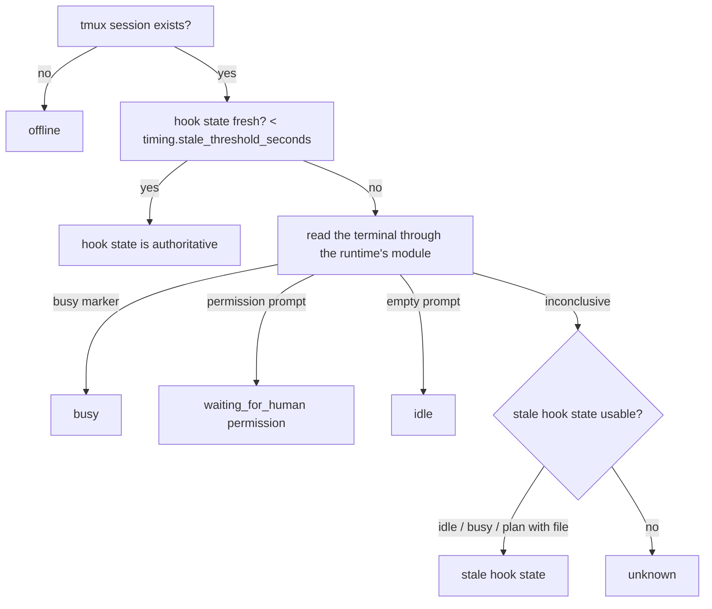

# How it works


Starting an existing agent reuses its saved CLI and model and begins a **new
conversation**. Continuing the previous one is your call: `backbone agent resume
NAME` (or `start --resume`; API `resume: true`) reopens the session the backbone
last saw for that runtime, or the runtime's own last conversation when no ID is
saved. A fresh start says when a previous conversation is available. Starts are
fresh by default because a resumed agent trusts its own context over whatever
happened in the checkout since — another CLI, a swarm, the shared memory.
Changing runtime without specifying a model clears the previous runtime's model.
Starting from a directory reuses its registered name, even after a rename;
if several agents share that directory, specify a name.

This page follows real requests through the system. Read
[Concepts](concepts.md) first if the vocabulary is new.

## 1. Starting an agent

`backbone agent start [--dir D] [--name N] [--runtime R] [--watch REPO]`
(or `POST /api/agents/start`, or `/start name` on Telegram):

1. **Discover.** Resolve the directory (default: cwd), derive the name from
   the directory name, read `git remote get-url origin` for the repository.
   If the agent is already known, its recorded settings are reused and
   updated. A known name registered for a directory that no longer exists
   is a move — the record follows the project; if the old directory still
   exists, the new one is a different project sharing a folder name and is
   registered as `name-2`.
2. **Record.** Upsert the agent (and any `--watch` repositories) in the
   database. The running backbone publishes a new configuration snapshot;
   every job uses it from the next tick.
3. **Skills.** For a runtime with a measured skills directory, link every
   store skill tagged for the agent into it (`.claude/skills`, `.agents/skills`),
   drop links no longer selected, hide the link names in `.git/info/exclude`,
   and fail the start if a selected skill does not resolve. Repository-owned
   skills are never touched ([skills](skills.md)).
4. **Launch.** `tmux new-session -d -s <name> -c <dir>` running the runtime
   command (`claude --model …`), with `BACKBONE_RUNTIME`, `BACKBONE_AGENT`,
   `BACKBONE_STATE_DIR` and the agent's `env` exported into the session.
   For Claude Code the command also carries
   `--settings <data_dir>/hooks/claude-settings.json` — a backbone-owned
   settings file, replaced atomically at every start, that wires the state hooks
   without touching the repository or `~/.claude/settings.json`.
5. **Wait until ready** (up to `timing.start_timeout_seconds`, 60 s): a
   fresh hook-written `idle` state, or a visible empty prompt for runtimes
   without hooks. A fresh busy or blocked hook keeps startup waiting even if
   the terminal shows an empty prompt. If the runtime is asking a question (Claude's folder-trust
   prompt, the "resume from summary" picker on `--resume`), `start` returns
   `waiting_for_human` with the question shown. `backbone agent approve` answers
   verified permission prompts; Claude Code's unnumbered pickers and a selected
   negative answer require a person in the terminal. Numbered options with a
   selection cursor are recognized generically; Claude also recognizes its
   unnumbered option block with the Enter/Esc footer. Startup always ends as
   `ready`, `waiting_for_human`, `exited` or `timeout`.
   An explicitly unattended Claude launch pre-records bypass consent in
   `~/.claude.json`; ordinary launches never do. The runtime's bypass flag still
   controls its mode. Folder trust remains controlled by `agents.pre_trust`.
5. Broadcast a fresh snapshot on Socket.IO `/sessions`.

Startup readiness uses the same state reconciliation as inspection and delivery,
with a launch timestamp fence to exclude old hooks and submission markers.
Current provider-capacity evidence therefore prevents a false ready result.

Starts with a database handle retain operational diagnostics under one operation
identity: the requested launch, its final outcome, elapsed time and classified
failure stage. Request-resolution and preflight rejections are recorded too.
`already_running` and `not_waited` describe exactly those outcomes; neither
asserts that a new runtime reached its prompt. The history stores model/runtime
identifiers and error types, without command arguments, directories, environment
values, brief text, terminal output or exception messages. See
[Learning from local usage](diagnostics.md) for the digest and investigation flow.

The model returned by agent APIs is the saved selection, labelled
`model_source: configured`. It does not confirm which model accepted a request
or produced a response. Startup can observe a provider error independently of
its readiness result: an input prompt and a rejected model request can both be
visible. The observation history keeps that distinction.

The running backbone serializes registration, edits, watches, start, stop and
forget for each agent. Edits update only the supplied database fields, so two
concurrent edits keep both changes. A start checks its resolved record again
before launching: if the agent was forgotten or changed meanwhile, it fails
with that reason. Forget waits for an active start and refuses to remove a
running session. Telegram `/start` uses this same operation and records startup
metadata. Swarm startup and teardown use the same per-agent locks.
If startup rollback cannot finish cleanup, the swarm stays active so `swarm
disband` can retry it; cleanup errors do not hide the original startup failure.

The backbone keeps no process handle; tmux owns the session. If the
backbone restarts, sessions keep running and are rediscovered. Sessions
you start by hand appear in `backbone status` with `configured: false`.
Register an agent with that session name before sending it messages through
the backbone; unregistered sessions cannot receive API messages or be streamed.

Stopping (`agent stop`) is `tmux kill-session`. The backbone refuses to
stop its own session. A session that dies on its own is **reported** (to
the escalation target and Telegram, once) — never restarted.

When the backbone is down, the CLI does the same thing directly against the
database and tmux, and says so.

## 2. State: how the backbone knows what an agent is doing



**Hook state** (`<data_dir>/state/<agent>.json`) is written first by the
backbone itself — `agent start` records `starting` the moment the tmux
session exists — and from then on by the runtime's shipped hook. Every
record carries the event that produced it (shown in `agent inspect`'s
evidence), the runtime's session id, and, after a turn, the agent's last
reply (clipped). One script per runtime maps that CLI's events onto the
shared vocabulary. Saved session IDs and last replies remain available when
terminal evidence supplies the current state, including after an offline
SessionEnd record expires; stale permission requests are not revived:

| Claude Code event | State written |
|---|---|
| `SessionStart` | `idle` (Claude is at its prompt) |
| `UserPromptSubmit` | `busy` (captures `owner/name#N` or `#N` from the prompt as the current issue) |
| `Stop` | `idle`, with `last_assistant_message` |
| `Notification` "needs your permission…" | `waiting_for_human` / `permission` |
| `Notification` `quota_auto_resume_*` | `blocked` / `quota` while Claude Code waits for its usage limit to reset (`detail` keeps its message); `busy` once it resumes |
| `PreToolUse ExitPlanMode` | `waiting_for_human` / `plan`, plan text saved to `<data_dir>/state/plans/<agent>.md` |
| `PreToolUse AskUserQuestion` | `waiting_for_human` / `question` |
| `PostToolUse` of either | `busy` |
| `SessionEnd` | `unknown` |

| Codex event | State written |
|---|---|
| `SessionStart` | `idle` |
| `UserPromptSubmit` | `busy` (issue captured from the prompt) |
| `PermissionRequest` | `waiting_for_human` / `permission` |
| `PreToolUse` | `busy` (the dialog is behind us) |
| `Stop`, `Interrupt` | `idle`, with `last_assistant_message` |
| `SessionEnd` | `unknown` |

| Gemini CLI event | State written |
|---|---|
| `SessionStart` | `idle` |
| `BeforeAgent` | `busy` (issue captured from the prompt) |
| `Notification` `ToolPermission` | `waiting_for_human` / `permission` |
| `BeforeTool` | `busy` |
| `AfterAgent` | `idle`, with `prompt_response` |
| `SessionEnd` | `unknown` |

| OpenCode plugin event | State written |
|---|---|
| `session.status` `busy` / `idle`, `session.idle` | `busy` / `idle` (the root session only; subagent sessions are ignored) |
| `permission.asked` / `permission.replied` | `waiting_for_human` / `permission`, then `busy` |
| `session.error` | `idle` |

The hooks parse actual `gh issue comment`, `gh pr comment` and `gh pr create`
commands into `<data_dir>/state/actions.jsonl`, with repository and branch
metadata. Claude, Codex and OpenCode record **intent** before execution to suppress a fast
self-notification. Only a **successful completion** acknowledges work; a failed
command or a quoted example cannot remove an issue from the agent's queue.
Legacy action records without completion evidence no longer acknowledge work.
Comment hooks honor an explicit repository and `GH_REPO`. If `gh repo set-default`
makes local attribution ambiguous, the hook leaves the action unscoped and waits
for repository-specific GitHub confirmation.

Direct commands, argv lists and `&&` chains are supported. Ambiguous shell
control flow, expansion, background execution and unknown completion output
are left to GitHub confirmation through the agent's `[from:NAME]` comment.
Claude's [completion hook](https://code.claude.com/docs/en/hooks#posttooluse)
is distinct from its failure hook; Codex's
[completion hook](https://learn.chatgpt.com/docs/hooks#posttooluse) also fires
for nonzero exits, so its result is checked explicitly.
How hooks reach a session is the runtime's business
([Getting started §3](getting-started.md#3-state-hooks--nothing-to-install)).

A fresh hook state is **authoritative**: these CLIs keep their input box
on screen while working, so the terminal alone would say "idle" while
they are busy. A fresh `idle` is checked for dialogs and current provider errors
drawn by the runtime itself: Claude
Code fires `SessionStart` with its resume picker still on screen, so a
fresh `idle` is checked against the terminal and a dialog there wins
(`waiting_for_human` / `question`, with the evidence saying so).

Runtime-specific capacity, quota and rate-limit banners produce `blocked`
with `reason: provider`, preserving the error and retry/reset detail. This
requires an error banner glyph or red error foreground, so ordinary response
text repeating the provider's words does not block delivery. This
overrides an idle hook or stale terminal fallback; fresh busy hooks remain
authoritative. Later response/tool output clears terminal-only failure evidence.
Messages stay queued, including priority messages. The monitor alerts humans,
the escalation target and active swarm coordinator/initiator, deduplicating
each recipient and retrying failed notification delivery.

**Terminal reading** is the fallback. Each runtime's module (`services/runtimes/<cli>.py`) knows its prompt
character, its status chrome (lines to ignore), its busy indicator
(Claude: `esc to interrupt`), its permission prompts (`Do you want to
proceed?`, the folder-trust question), and how to tell typed text from a
dim placeholder.

Every reading carries its evidence. `backbone agent inspect app` shows the
state, the delivery condition, the evidence lines, the terminal tail and
the recent deliveries — the first thing to look at when a delivery did not
happen.

Runtime adapters also classify a small set of terminal observations for the
diagnostic history, using panes already captured by startup or monitoring.
These observations do not change hook authority or delivery conditions. Codex
structured error banners retain an HTTP status and error type; a recognized
model/account incompatibility adds its reason and model identifier. A visible
model-change notice is a separate informational observation. Both can remain
in one pane, so seeing the notice does not establish that a subsequent request
succeeded. Repeated visibility updates an observation count, while distinct
model/error metadata remains separate. Empty or failed captures cannot establish
that an earlier error disappeared. Errors that appear and leave between captures
may be missed; this is bounded observation rather than a transcript recorder.

## 3. Sending a message

`backbone tell`, `POST /api/messages`, Telegram `/tell`, GitHub events and
agent-to-agent calls all end in the same function, `safe_deliver`. It returns one
detailed delivery receipt, including the outcome and any durable queue identity:

```mermaid
sequenceDiagram
    participant C as Caller
    participant B as Backbone
    participant Q as Queue (database)
    participant T as tmux session
    C->>B: message for "app"
    B->>B: delivery condition (state + terminal)
    alt ready / unknown
        B->>T: paste-buffer; Enter
        B->>T: re-read pane: submitted? still in the box?
        B-->>C: delivered
    else offline / waiting_for_human / agent_working / human_reading / human_typing / settling
        B->>Q: enqueue (direct messages, comments, notices)
        B-->>C: agent_working (etc.)
        Note over Q: delivered by agent-monitor (60 s) or delivery-retry (5 min)
    end
    B->>B: record the delivery (kind, repo, outcome, preview)
```

- **One delivery per session at a time.** The server serializes the readiness
  check, paste, verification and delivery record. Other sessions remain
  independent.
- **Envelope.** The API adds `[via:backbone from:<from_entity>] `; Telegram
  `[via:telegram from:<name>]`; GitHub events `[via:github issue:N]`.
- **Paste, don't type.** Text goes in through tmux's paste buffer as one
  chunk, then Enter; the pane is re-read to confirm the text left the input
  box, including an envelope still buffered in the prompt. If the runtime queued it for its next turn (Claude does), that
  counts as delivered.
- **Busy is never bypassed.** `priority: true` (and issues labelled
  `blocking`) only get through `human_typing` and `settling`.
- **Comments**, including those on the current issue, wait while the agent is
  starting, busy, blocked, or waiting for a human. They are queued and delivered
  when the agent is ready; priority does not bypass these conditions.
- **Human selection.** Copy mode is preserved during monitoring and readiness
  checks. Messages wait with `human_reading` until the human exits copy mode;
  priority does not bypass it.
- **Queue hygiene.** Ordinary pending messages expire after `timing.queue_expiry_minutes`
  (30). Active swarm coordination and inbox holds are retained. Leased by a crashed drain: released after 5 min. A blocked drain
  keeps the original row, including when displaying its age; completed rows
  are pruned after `timing.delivery_retention_days` from completion.
- **Everything is recorded**, direct messages included:
  `GET /api/deliveries`, `backbone agent inspect`.

## 4. GitHub

### Intake

| Intake | When | How |
|---|---|---|
| `poll` | `GITHUB_TOKEN` (or App credentials) and no webhook secret | every `github.poll_interval_seconds`, list issues and comments from the durable replay cursor for each tracked repository |
| `webhook` | `GITHUB_WEBHOOK_SECRET` is set | GitHub posts to `/webhooks/github`; signature verified; **one backfill poll at startup** catches what happened while the backbone was down |
| `off` | no credentials, or `github.intake = off` | — |

Tracked repositories = every repository any agent owns or watches. Both
paths produce the same event, which is stored in the `events` table
(deduplicated by delivery id). The full recipient plan is then stored in
`event_outbox` before delivery. Each completed delivery or durable queue write
gets a receipt; only unresolved recipients are retried after failure or restart.

### An issue is opened

```mermaid
sequenceDiagram
    participant GH as GitHub
    participant B as Backbone
    participant A as app (owner)
    participant O as orch (watcher)
    GH->>B: acme/app#42 opened, labels: bug, from:planner
    B->>B: owners(acme/app) = [app]; watchers = [orch]
    B->>GH: app's open queue (queue scope)
    B->>B: gate: already delivered? older issue unacknowledged?
    B->>B: claim (acme/app, 42) for app — atomic
    B->>A: [via:github issue:42] New issue targeting you: acme/app#42 [bug] "…" (from planner). Link: …
    B->>O: [via:github issue:42] FYI: new issue acme/app#42 [bug] "…" (from planner). Link: …
```

Routing for an issue in repository R:

1. `for:<agent>` labels → those agents' queues (explicit always wins).
2. Otherwise, if R has one owner → its queue. Several owners → all of them
   get an "unassigned issue — comment to claim it" notice, nobody is queued.
3. Watchers of R get an informational notice (kind `watch`, never queued as
   work, expires like any queued message).
4. The sender (`from:`) never gets its own issue.

An **edit** of an existing issue (`labeled` events without a new `for:`
label) routes nobody.

The **issue queue gate** keeps issue delivery orderly: an agent gets one
issue at a time. A newer issue is held (`awaiting_ack`) while the last
delivered issue in the agent's open queue has not been acknowledged.
**Acknowledgement** = the agent commented on the issue (or opened a pull
request that closes it): detected from the hook action log, a
`[from:<agent>]` comment prefix, or GitHub comments on
the next poll.

An agent's **queue** is the union of `for:<agent>` issues in every
repository it owns or watches plus, if it is the sole owner of its
repository, that repository's unlabelled open issues. Swarm members are not
repository owners. The queue excludes the issue's sender and uses the complete
open listing before scoring. The score combines the blocking bonus,
type weight, recorded dependent counts and age in days from GitHub creation time (see [GitHub](github.md#the-agents-queue-and-its-order)).

### A comment is added

Audience = `for:` targets ∪ the `from:` opener ∪ the sole owner, minus the
commenter and anyone in `routing.ignore_targets`. The commenter's
acknowledgement is recorded; the targets' acknowledgements are cleared.

### A review is submitted on a pull request

Audience as for a comment (the pull request's `for:` targets, its `from:`
opener and the sole owner), minus the reviewer when it is an agent
(`[from:X]` in the review body). One message per review — verdict,
summary preview, reviewed commit and current head, link — not one per inline comment: every inline comment
belongs to a review, and the agent reads them on GitHub. A review on a
closed pull request notifies nobody. Reviews arrive through webhooks; configured reviewer accounts are also polled.
Their PR comments are suppressed in favor of started/finished lifecycle notices
anchored to the reviewed commit. See [review lifecycle](github.md#review-lifecycle).

### An issue is closed — close-then-next

1. Queued messages about the issue are purged.
2. Each target gets its **next** issue (highest priority in its queue).
3. The opener (`from:`), if it is an agent and not a target, is told the
   issue was closed.
4. If the issue was a sub-issue and all siblings are closed, the parent's
   targets get an "unblocked" notice.

### Pull requests

Opened in R: owners and watchers of R are told (informational).

## 5. Background monitoring

Every `timing.monitor_interval_seconds` (60 s), `agent-monitor`:

1. Refreshes agents and settings from the database, reads every running
   agent's state **once** and mirrors it into the `agent_states` table.
2. Syncs sub-issue relationships for open issues.
3. **Stalls**: `busy` on one issue for > `timing.stall_threshold_seconds`
   (90 min) → one message to `escalation.target`, deduplicated for
   `timing.escalation_dedup_seconds` (30 min).
4. **Dead sessions**: an agent that had a live state and has no session now
   → reported to `escalation.target` and Telegram, once; state reset.
   Never restarted.
5. **Plan waiting**: Telegram notification (`/viewplan`, `/approve`) and a
   message to `escalation.target`, once per plan after delivery or successful
   queue storage. A failed queue write is retried on the next monitor tick.
6. Socket.IO `/sessions` snapshot if anything changed.
7. Drains the queue for sessions that are now idle.
8. **Pending issues**: every idle agent with an empty in-flight slot gets
   the highest-priority unacknowledged open issue from its queue.

Every `timing.retry_interval_seconds` (5 min), `delivery-retry` resumes pending
GitHub outbox recipients, re-attempts older issue delivery records that ended
`offline`/`delivery_failed`/`agent_working`, and drains the queue again.
Issue retries and queued issue deliveries re-check
the current issue: acknowledged, closed or no-longer-targeted work, and records without
repository metadata, are retired so it cannot occupy the oldest retry slots forever. A failure
in one record or session does not stop the others.

## 6. Integrations (Telegram)

Human-facing channels implement one contract ([Integrations](integrations.md)):
inbound text becomes a normal `safe_deliver` with a `[via:<integration>
from:<who>]` envelope, agents answer with `backbone reply` (→ `POST
/api/integrations/reply`), and alerts from the monitor go through
`notify_humans` into the agent's surface when it has one.

Telegram is the shipped integration. The bot runs inside the backbone
process and reads the live configuration. Commands map to the same
operations as the CLI (`/status`, `/tell`, `/start`, `/stop`, `/queue`,
`/digest`, `/viewplan`, `/approve`). In a forum group the bot creates one
topic per registered agent (on start, when agents change, every five
minutes): writing there talks to that agent, and the agent's `backbone
reply` lands there. See [Telegram](telegram.md).

## 7. Dashboards and scripts

Agent snapshot projections live in the agents service; API caching and Socket.IO
emission consume those projections, as does offline CLI status.

- REST for state and actions (`/api/agents`, `/api/agents/{name}/inspect`,
  `/api/messages`, `/api/issues`, `/api/deliveries`, `/api/events`,
  `/api/plans`, `/api/status`, `/api/config`).
- Socket.IO `/sessions`: a full snapshot of all agents (`sessions:update`)
  whenever anything changes, and at least every minute.
- Socket.IO `/terminal`: a **read-only** live stream of any session's
  terminal output. Nothing typed in a browser reaches an agent.

See [API](api.md).

## 8. When the backbone is down

Agents keep running — they are tmux sessions. API calls fail. Messages
sent by other agents are lost (they should retry). GitHub events are
caught up on restart: poll intake resumes from its durable per-repository cursor;
webhook intake runs its startup backfill. The `agent-monitor` job runs
its first tick immediately, so hook state for every running session is
re-read and missed plan-waiting notifications fire right after a restart.
A failed plan-notification delivery remains retryable on the next monitor cycle;
it does not prevent notifications for other waiting plans in the same cycle.

Queue lists and sub-issue reads share one complete repository snapshot within a
monitor tick or close event. Each tick/request starts a new snapshot; a failed
read stays failed within that snapshot. Arbitrary label queries go directly to
GitHub with their requested filters and pagination. Status fans out with at most eight
concurrent reads. Terminal readiness and individual issue retirement checks stay
fresh at delivery time.

Shell action hooks infer repository and branch from the tool's effective `workdir`
or `cwd` override when provided, rather than attributing a command to the parent
conversation directory. Explicit GitHub repository arguments still take precedence.
OpenCode's launch wrapper merges the state plugin into the environment actually
inherited by the new process, preserving inline provider settings and permission
denies. Unsupported inline JSON/JSONC is preserved unchanged and hook injection
is skipped; terminal state detection remains available.


For automatic upgrades, `backbone up` requests Uvicorn’s graceful exit directly
and re-executes after shutdown completes. External termination still stops the
process normally. A custom ASGI runner that does not install this shutdown
callback does not perform Backbone’s automatic restart; its supervisor owns
restart behavior. `--reload` continues to use Uvicorn’s development reloader.


See [message checkpoints](cli.md#cooperative-message-checkpoints) for safe mid-turn
coordination, acknowledgement and retention.
