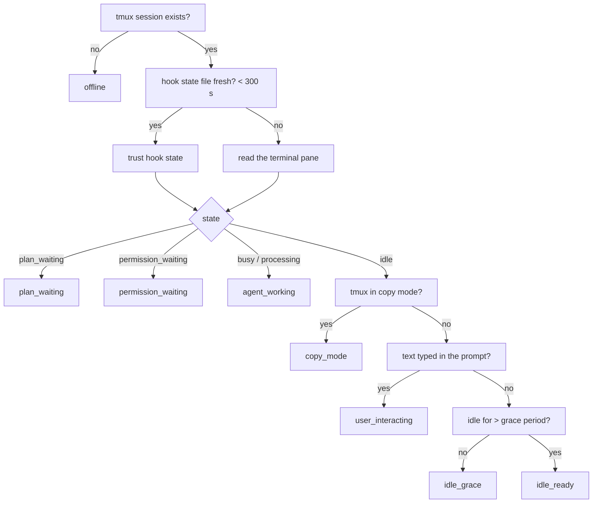
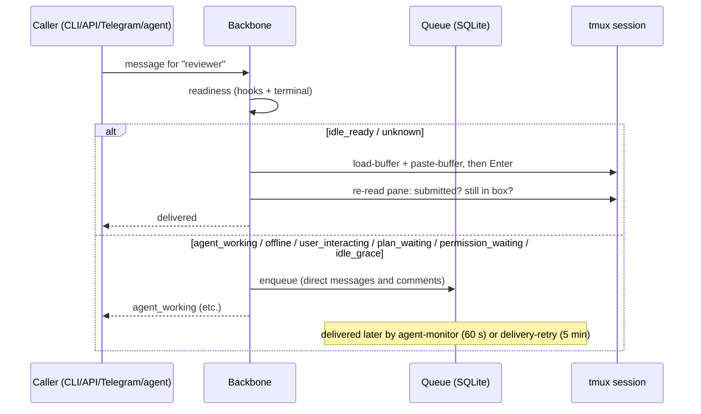
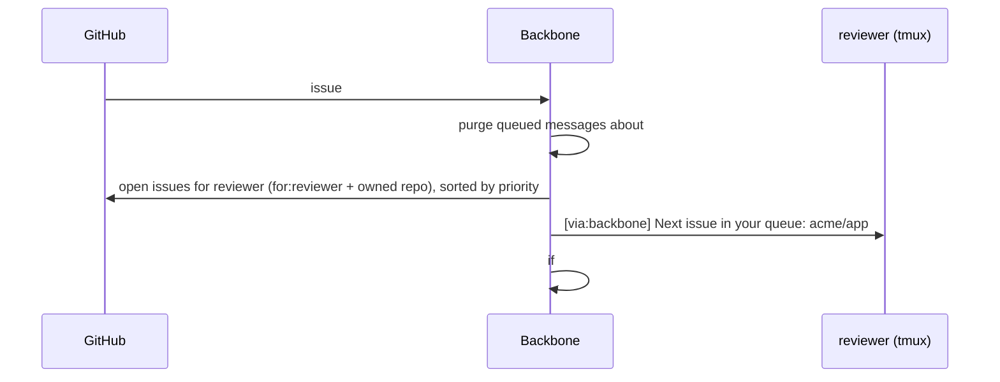

# How it works

This page follows real requests through the system. Read
[Concepts](concepts.md) first if the vocabulary is new. Each section ends
with **Open questions** — places where the current behaviour is a choice, not
a law, and feedback is wanted.

## 1. Starting an agent

`backbone agent start reviewer` (or `POST /api/agents/reviewer/start`, or
`/start reviewer` on Telegram):

1. Look up `[agents.reviewer]`; refuse if the directory does not exist or the
   runtime binary is not installed.
2. `tmux new-session -d -s reviewer -c ~/code/app` running the runtime
   command (`claude --model …`), with these variables exported into the
   session: `BACKBONE_RUNTIME=claude`, `BACKBONE_AGENT=reviewer`,
   `BACKBONE_STATE_DIR=<data_dir>/state`, plus anything in the agent's `env`.
3. Broadcast a fresh snapshot on Socket.IO `/sessions`.

The backbone does not keep a process handle; tmux owns the session. If the
backbone restarts, sessions keep running and are rediscovered. Sessions you
start by hand (`tmux new -s scratch`) appear in `backbone status` and
`/api/agents` with `configured: false` and can still receive messages.

Stopping (`agent stop`) is `tmux kill-session`. The backbone refuses to stop
its own session.

**Open questions**
- Should `start` wait until the runtime is actually at its prompt (via the
  hook's `SessionStart`) before returning, so a `tell` right after `start`
  never races? Today it returns as soon as tmux is up.
- Should the backbone auto-restart a configured agent whose session died,
  or only report it (today: reports it, escalates once)?

## 2. Readiness: how the backbone knows an agent is free

Two sources, combined by `get_session_intelligence`:



**Hook state** (`<data_dir>/state/<agent>.json`) is written by the shipped
Claude Code hook on these events:

| Claude Code event | State written |
|---|---|
| `SessionStart` | `idle` (Claude is at the prompt) |
| `UserPromptSubmit` | `busy` (also captures `issue: N` if the prompt mentions an issue) |
| `Stop` (turn finished) | `idle` |
| `Notification` "needs your permission…" | `permission_waiting` |
| `PreToolUse ExitPlanMode` | `plan_waiting` + plan text saved to `<data_dir>/state/plans/<agent>.md` |
| `PostToolUse ExitPlanMode` | `busy` (plan approved) |
| `SessionEnd` | `unknown` |

A fresh hook state is **authoritative**. This matters: Claude Code's current
UI keeps the `❯` input box on screen while the model is working, so reading
the terminal alone would say "idle" while it is busy.

**Terminal reading** is the fallback when there is no hook state or it is
older than five minutes. Each runtime adapter knows its prompt character,
its status chrome (lines to ignore), its busy indicator (Claude: `esc to
interrupt`), and how to tell typed text from a dim placeholder/suggestion.

**Open questions**
- Five minutes stale threshold: too long? A missed `Stop` hook (crash) means
  five minutes of believing the agent is busy before the terminal is consulted.
- `idle_grace` (5 s after becoming idle) exists so a message does not land
  while the runtime is still redrawing. Is it noticeable in practice?

## 3. Sending a message

`backbone tell reviewer "…"`, `POST /api/messages`, Telegram `/tell`, and
agent-to-agent calls all end in the same function, `safe_deliver`:



Details that matter:

- **Envelope.** The API adds `[via:backbone from:<from_entity>] ` in front of
  the text. Telegram adds `[via:telegram from:<name>]`. GitHub events carry
  `[via:github issue:N]`. The receiving agent should treat everything after
  the envelope as untrusted input.
- **Paste, don't type.** Text goes in through tmux's paste buffer as one
  chunk, so multi-line messages become one turn. Then Enter is pressed (twice
  for runtimes that need a settle), and the pane is re-read to confirm the
  text left the input box.
- **Queued inside the runtime.** If Enter is pressed while Claude Code is
  still finishing a turn, Claude keeps the text and runs it next. The
  backbone recognises this (`busy` indicator + text still in the box) and
  counts it as delivered instead of queuing a second copy.
- **`priority: true`** bypasses `user_interacting` (a human is typing) and
  `copy_mode`; it never bypasses `plan_waiting`, `permission_waiting` or
  `agent_working`. GitHub issues labelled `blocking` are delivered with
  priority.
- **Queue hygiene.** A queued message that is still undelivered after 30
  minutes is expired. A message leased by a crashed drain is released after
  5 minutes.

**Open questions**
- 30-minute expiry: for a direct message ("please review X") that seems
  right; for an issue comment it may be wrong — the comment is still on
  GitHub, but the agent never hears about it. Alternative: never expire
  comments, expire only direct messages.
- Direct messages are currently not written to the `deliveries` history
  table (only issue-related deliveries are). A dashboard probably wants to
  see them. Worth adding?

## 4. GitHub Issues as the task queue

Two ways for events to arrive, one code path after that:

- **Polling** (`mode = "poll"`): every 30 s, list issues and comments updated
  since the last checkpoint in the coordination repo and in every
  agent-owned repo. Nothing to expose.
- **Webhook** (`mode = "webhook"`): GitHub posts to `/webhooks/github`;
  signature verified with `GITHUB_WEBHOOK_SECRET`. Use `gh webhook forward`
  for a no-tunnel setup or a named cloudflared tunnel for a stable URL.

Both produce the same normalised event and both are deduplicated by event id,
so running them together is safe.

### 4a. An issue is opened

```mermaid
sequenceDiagram
    participant GH as GitHub
    participant B as Backbone
    participant R as reviewer (tmux)
    GH->>B: issue #42 opened, labels for:reviewer, bug, blocking
    B->>B: targets = [reviewer]; skip if sender == target
    B->>GH: list open for:reviewer issues (queue scope)
    B->>B: issue queue gate: is #42 already delivered? is an older delivered issue still unacknowledged?
    B->>B: claim #42 for reviewer (atomic)
    B->>R: [via:github issue:42] New issue targeting you: acme/app#42 [bug] "…" (from planner, blocking). Link: …
    B->>B: record delivery outcome
```

The **issue queue gate** is what makes issue delivery orderly: an agent gets
**one issue at a time**. A newer issue is held (`awaiting_ack`) while the
last delivered issue has not been acknowledged. Acknowledgement means the
agent commented on the issue — detected from the hook's action log when the
agent ran `gh issue comment`, from a `[from:reviewer]` tag in a comment, or
from GitHub comments on the next poll.

Issues without `for:` labels opened in a repository an agent owns
(`repo = "acme/app"`) go to that agent. Pull requests opened in an owned
repository are announced to the owner (no queue gate).

### 4b. A comment is added

Participants = `{from:` sender`} ∪ {for:` targets`}` minus the commenter
minus humans listed in `routing.ignore_targets`. Each gets
`[via:github issue:42] New comment on acme/app#42 "…" from planner: "…"`.
The commenter's acknowledgement is recorded; the targets' acknowledgements
are cleared (new information for them). Comments on the issue the agent is
*currently working on* are delivered even while it is busy; comments on other
issues wait.

### 4c. An issue is closed — close-then-next



Priority order for "next": `blocking` first, then by type weight
(`spec-gap` 100 > `bug` 90 > `task` 50 > `question` 20 > `optimization` 10),
then oldest first. Weights are configurable.

### 4d. The agent side

The backbone only delivers text; the agent has to know what to do with it.
The expected protocol is small — see
[GitHub → What an agent is expected to do](github.md#what-an-agent-is-expected-to-do).

**Open questions**
- A delivered-but-unacknowledged issue blocks the agent's queue forever and
  is never re-sent. Should the monitor nudge ("you still have #42 open,
  unacknowledged") after N minutes, or escalate?
- One-issue-at-a-time is enforced per agent. Should an agent be able to opt
  into a concurrency of N (e.g. an agent that spawns sub-agents)?
- Acknowledgement = "commented". Is a comment the right signal, or should
  the agent assign itself / add a label (`ack:reviewer`)? Labels are visible
  at a glance in the issue list.
- `from:` labels identify the *opener* for routing replies. Should the
  backbone add `from:<agent>` automatically when an agent creates an issue
  through the API (it does not today)?

## 5. Background monitoring

Every 60 s, `agent-monitor`:

1. Syncs sub-issue relationships for open issues (for the unblock notification).
2. **Stalls**: an agent `busy`/`processing` on an issue for > 90 min → one
   message to `escalation.target` (deduplicated for 30 min).
3. **Unexpected offline**: an agent that was `busy`/`idle` last time and has
   no session now → one message to `escalation.target`, state reset.
4. **Plan waiting**: a Telegram notification (`/viewplan`, `/approve`) and a
   message to `escalation.target`, once per plan.
5. **Copy mode**: if a session sits in tmux copy mode, send `q` once; alert
   on Telegram if it persists.
6. Push a live snapshot to Socket.IO `/sessions` if anything changed.
7. Drain the queue for sessions that are now idle.
8. **Pending issues**: for every idle configured agent with an empty
   in-flight slot, deliver the highest-priority unacknowledged open issue.

Every 5 min, `delivery-retry` re-attempts issue deliveries that ended
`offline`/`delivery_failed`/`agent_working` and drains the queue again.

**Open questions**
- Escalation goes to one agent (`escalation.target`). Should it also, or
  instead, go to Telegram? (Plan-waiting already does both.)
- 90 minutes as the stall threshold assumes long tasks. Per-agent override?

## 6. Telegram

The bot runs inside the backbone process. Commands map to the same
operations as the CLI (`/status`, `/tell`, `/start`, `/stop`, `/queue`,
`/digest`, `/viewplan`, `/approve`). In a forum group, each topic can be mapped
to an agent, so writing in the "reviewer" topic *is* `tell reviewer`, and a
catch-all "agents" topic accepts `builder: rebase please`. Agents can reply
into their topic via `POST /api/telegram/reply`. See [Telegram](telegram.md).

## 7. Dashboards and scripts

The backbone does not ship a UI. It exposes:

- REST for state and actions (`/api/agents`, `/api/messages`, `/api/issues`,
  `/api/deliveries`, `/api/plans`, `/api/status`).
- Socket.IO `/sessions`: a full snapshot of all agents (`sessions:update`)
  whenever anything changes, and at least every minute.
- Socket.IO `/terminal`: a **read-only** live stream of any session's
  terminal output (join with `{session, cols, rows}`; receive
  `terminal_output` chunks). Nothing typed in a browser reaches an agent.

See [API](api.md).

## 8. What happens when the backbone is down

Agents keep running — they are tmux sessions. Messages sent to the API fail
(callers see connection errors). GitHub events are missed in webhook mode
and caught up in polling mode (the checkpoint resumes where it left off,
after an initial 5-minute look-back on a fresh install). On restart the
backbone re-reads hook state for every running session and fires
plan-waiting notifications it may have missed.
